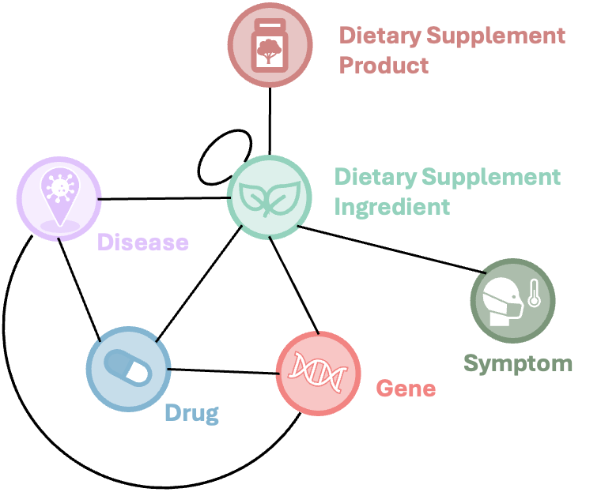

# eDISK: An Enriched Dietary Supplement Knowledgebase

**eDISK** is an enriched version of [iDISK](https://github.com/houyurain/iDISK2.0), the integrated Dietary Supplement Knowledgebase[1]. The goal of eDISK is to provide a more comprehensive and diverse resource for dietary supplement (DS) knowledge by integrating information from a variety of public, literature-based, and real-world data sources.

## 🔍 Overview

eDISK extends iDISK by incorporating additional resources and data modalities. It aims to support research and applications involving dietary supplements, including safety, efficacy, interactions, and adverse events.
The following diagram illustrates the overall schema of eDISK and how its components are integrated:

<p align="center">
  
</p>

## 📚 Data Sources

eDISK is built from the integration of the following key resources:

1. **Public Databases**
   - [About Herbs](https://www.mskcc.org/cancer-care/diagnosis-treatment/symptom-management/integrative-medicine/herbs) from the Memorial Sloan Kettering Cancer Center (MSKCC)
   - [Dietary Supplement Label Database (DSLD)](https://dsld.od.nih.gov/)
   - [Licensed Natural Health Products Database (LNHPD)](https://health-products.canada.ca/lnhpd-bdpsnh/index-eng.jsp)

2. **SuppKG**  
   A literature-derived knowledge graph of dietary supplement-related knowledge constructed using NLP techniques[2].

4. **Social Media Mining**  
   Dietary supplement-related knowledge extracted from Twitter using natural language processing.

5. **Database of Dietary Supplement Adverse Events ([DDSAE](https://github.com/zhang-informatics/DDSAE))**  
   A collection of DS-adverse event signals derived from the CFSAN Adverse Event Reporting System (CAERS). Includes adverse events associated with both dietary supplement products and ingredients.

6. **[Supp.AI](https://supp.ai/)**  
   An automated system that extracts evidence of supplement–drug interactions from scientific literature[3].

## ⚡ Quick Start

The UI agent is a Django application that orchestrates OpenAI services, a FAISS similarity index, and a Neo4j knowledge graph.
Follow the steps below to get a local instance running.

### 1. Clone and prepare a Python environment

```bash
git clone https://github.com/<your-org>/eDISK.git
cd eDISK
python -m venv .venv
source .venv/bin/activate  # On Windows use: .venv\Scripts\activate
pip install --upgrade pip
pip install -r requirements.txt
```

> **Note:** `torch` and `pykeen` are heavy but required for the TransE link-prediction module. If you only need the basic graph
> retrieval pipeline, remove those lines from `requirements.txt` before installing.

### 2. Configure credentials and paths

Create a `.env` file or export environment variables before launching Django. At minimum you need valid endpoints for OpenAI
and Neo4j, along with local paths to the pre-built embeddings and indexes referenced in
[`eDISK_UI/eDISK_UI/settings.py`](eDISK_UI/eDISK_UI/settings.py).

```bash
export OPENAI_API_KEY="sk-..."
export OPENAI_CHAT_MODEL="gpt-4o-mini"          # Override if you use a different chat model
export OPENAI_EMBED_MODEL="text-embedding-3-small"

export NEO4J_URI="neo4j://<host>:7687"
export NEO4J_USER="neo4j"
export NEO4J_PASSWORD="<password>"

# Update these to point to your local data bundle
export EDISK_DATA_DIR="/path/to/edisk_data"
export EMB_SQLITE_PATH="/path/to/entity_embeddings.db"
export FAISS_INDEX_PATH="/path/to/faiss.index"
export FAISS_META_PATH="/path/to/faiss.meta.pkl"
export PYKEEN_MODEL_DIR="/path/to/pykeen_transe"

export QUERY_LOG_DIR="$(pwd)/eDISK_UI/ui_agent/logs"
```

If you prefer not to use environment variables, edit the corresponding constants at the bottom of
`eDISK_UI/eDISK_UI/settings.py`.

### 3. Load the FAISS index (optional)

If you only have the SQLite embeddings (`entity_embeddings.db`), build the FAISS index and metadata files once:

```bash
cd eDISK_UI
python manage.py build_faiss_index
cd ..
```

This command reads the embeddings database and creates the files referenced by `FAISS_INDEX_PATH` and `FAISS_META_PATH`.

### 4. Run database migrations

```bash
cd eDISK_UI
python manage.py migrate
cd ..
```

### 5. Start the development server

```bash
cd eDISK_UI
python manage.py runserver 0.0.0.0:8000
```

### 6. Start front-end

```bash
cd eDISK_UI
cd edisk-react
python pnpm run dev
```

Open <http://localhost:3000/> to access the chat interface. Each query triggers a background thread that updates progress
messages via `GET /api/progress/<run_id>` until the pipeline marks the run as finished.

### 7. Demo
<video controls width="720" muted>
  <source src="eDISK_Agent_demo.mp4?raw=1" type="video/mp4" />
  Your browser does not support the video tag. You can
  <a href="docs/media/demo.mp4?raw=1">download the demo video here</a>.
</video>

## 📑 References

[1] Hou Y, Bishop JR, Liu H, Zhang R. Improving Dietary Supplement Information Retrieval: Development of a Retrieval-Augmented Generation System With Large Language Models. J Med Internet Res. 2025 Mar 19;27:e67677. doi: 10.2196/67677. PMID: 40106799; PMCID: PMC11966073.

[2] Schutte D, Vasilakes J, Bompelli A, Zhou Y, Fiszman M, Xu H, Kilicoglu H, Bishop JR, Adam T, Zhang R. Discovering novel drug-supplement interactions using SuppKG generated from the biomedical literature. J Biomed Inform. 2022 Jul;131:104120. doi: 10.1016/j.jbi.2022.104120. Epub 2022 Jun 13. PMID: 35709900; PMCID: PMC9335448.

[3] Wang, L.L., Tafjord, O., Cohan, A., Jain, S., Skjonsberg, S., Schoenick, C., Botner, N. and Ammar, W., 2019. SUPP. AI: finding evidence for supplement-drug interactions. *arXiv preprint*, 2019. *arXiv:1909.08135*.
